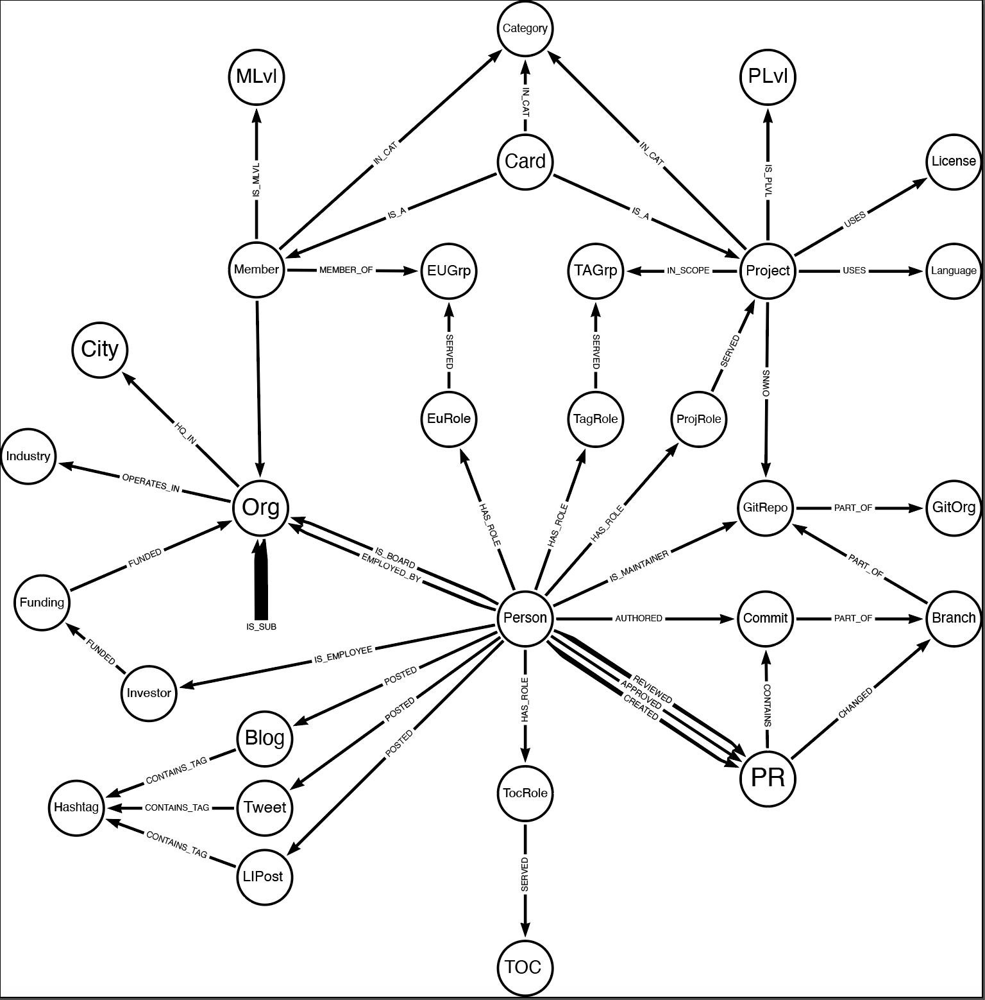

# CNCF Landscape Graph

:construction:
While we remodel the facilities, join us in extending a big thanks the Github OCTO and the GitHubNext team :)

https://flatgithub.com/halcyondude/landscape-graph/blob/main/landscape-items.json

More info: https://next.github.com/projects/flat-data

---

In November of 2018 there were 25 CNCF projects. 

At the time [Ayrat Khayretdinov][archyufa] published the "[Beginner's Guide to the CNCF Landscape][guide]." It opened with:

[archyufa]: https://twitter.com/archyufa
[guide]: https://www.cncf.io/blog/2018/11/05/beginners-guide-cncf-landscape

> The cloud native landscape can be complicated and confusing. Its myriad of **open source projects are supported by the constant contributions of a vibrant and expansive community.** The Cloud Native Computing Foundation (CNCF) has a landscape map that shows the full extent of cloud native solutions, many of which are under their umbrella.

It described the CNCF Mission in these terms:

> The CNCF fosters this landscape of open source projects by **helping provide end-user communities with viable options for building cloud native applications.** By encouraging projects to collaborate with each other, the CNCF hopes to enable fully-fledged technology stacks comprised solely of CNCF member projects. **This is one way that organizations can own their destinies in the cloud.**

## We. Have. Grown.

Today there are 5.4 million humans using Kubernetes and the landscape continues to expand.

<!-- TODO: center colums -->
| 2022 Q2   | Cards | GitHub :star: | cap      | funding |
| --------  | ---   | -----         | ---      | ------  |
| projects  | 111   | 614,394       | $291.4 M | $29.6 M |
| ecosystem | 1,061 | 3,066,372     | $15.7 T | $29.1 B  |

## We have a "good" problem

The landscape's growing breadth and reach motivate new ways to assess, analyze, and comprehend the "vibrant and expansive community" that continues to foster it's growth, adaptation, and evolution.

The [CNCF Landscape][landscape] aggregates summary data from GitHub, Crunchbase, Yahoo Finance, Twitter, and other sources while providing the ability quickly find, filter, and group the more than 1000 Cards and is updated daily, automatically. It continues to work as designed.

[landscape]: https://landscape.cncf.io

_TODO diagram:  existing landscape workflow yielding https://landscape.cncf.io/data/items.json._

## Technical Overview


| Component         | What 
| --------     | --------
| Neo4j        | Graph Database
| Neo4j ETL    | <https://neo4j.com/labs/etl-tool>
| gitbase      | Git history as MySQL, [src-d/gitbase](https://github.com/src-d/gitbase)
| JavaFX       | UI, 3d, [openjfx.io](https://openjfx.io)               | 
| Quarkus      | AoT, minify, Dev UX, [quarkus.io](https://quarkus.io)

Using the [data][seeddata] underlying the existing landscape as input, a Labeled Property Graph ([LPG][lpg]) is constructed using [Cypher][ocypher] (SQL for Graphs), resulting in a [Neo4j][neo] graph database.

[seeddata]: https://landscape.cncf.io/data/items.json
[lpg]: https://neo4j.com/blog/rdf-triple-store-vs-labeled-property-graph-difference
[ocypher]: https://opencypher.org
[neo]: https://neo4j.com
[cypherdev]: https://neo4j.com/developer/cypher/

## Landscape Graph Data Model



### Neo4J Graph Database


### Cypher ("SQL for Graphs")


```cypher
// Node property
(p:Person {name: 'Jennifer'})

// Relationship property 
-[rel:IS_FRIENDS_WITH {since: 2018}]->

// Jennifer likes graphs
(p:Person {name: "Jennifer"})-[rel:LIKES]->(g:Technology {type: "Graphs"})
```

<https://github.com/opencypher/openCypher>

> Cypher is a declarative graph query language that allows for expressive and efficient querying, updating and administering of the graph. It is designed to be suitable for both developers and operations professionals. Cypher is designed to be simple, yet powerful; highly complicated database queries can be easily expressed, enabling you to focus on your domain, instead of getting lost in database access.

> Cypher is inspired by a number of different approaches and builds on established practices for expressive querying. Many of the keywords, such as WHERE and ORDER BY, are inspired by SQL. Pattern matching borrows expression approaches from SPARQL. Some of the list semantics are borrowed from languages such as Haskell and Python. Cypher’s constructs, based on English prose and neat iconography, make queries easy, both to write and to read.

## Landscape Data Model (base)


### Schema


###  Constraints

```
CREATE CONSTRAINT IF NOT EXISTS FOR (n:Card) REQUIRE n.name IS UNIQUE;
CREATE CONSTRAINT IF NOT EXISTS FOR (n:Category) REQUIRE n.name IS UNIQUE;
CREATE CONSTRAINT IF NOT EXISTS FOR (n:Headquarters) REQUIRE n.name IS UNIQUE;
CREATE CONSTRAINT IF NOT EXISTS FOR (n:Industry) REQUIRE n.name IS UNIQUE;
CREATE CONSTRAINT IF NOT EXISTS FOR (n:Language) REQUIRE n.name IS UNIQUE;
CREATE CONSTRAINT IF NOT EXISTS FOR (n:License) REQUIRE n.name IS UNIQUE;
CREATE CONSTRAINT IF NOT EXISTS FOR (n:Organization) REQUIRE n.name IS UNIQUE;
CREATE CONSTRAINT IF NOT EXISTS FOR (n:Path) REQUIRE n.name IS UNIQUE;
CREATE CONSTRAINT IF NOT EXISTS FOR (n:Project) REQUIRE n.name IS UNIQUE;
CREATE CONSTRAINT IF NOT EXISTS FOR (n:Relation) REQUIRE n.relation IS UNIQUE;
CREATE CONSTRAINT IF NOT EXISTS FOR (n:Repo) REQUIRE n.name IS UNIQUE;
```

### Load Landscape Data

```
//
// APOC - Awesome Procedures on Cypher - https://neo4j.com/labs/apoc
//
// MERGE - Create, or match an existing node
//       - Graph Database variant of https://www.sqlite.org/lang_upsert.html
//

CALL apoc.load.json("https://landscape.cncf.io/data/items.json") YIELD value
MERGE (c:Card {name: value.name})
ON CREATE SET
   c += value { 
      .bestPracticeBadgeId, 
      .bestPracticePercentage, 
      .commitsThisYear, 
      .contributorsCount, 
      .crunchbase, 
      .description, 
      .homepage_url, 
      .isSubsidiaryProject, 
      .logo,
      .member, 
      .name,      // i
      .oss,       // i
      .repo_url, 
      .stars, 
      .twitter
   }   
WITH c, value

MERGE(ossl:License { name: value.license })
   MERGE (c)-[:HAS_LICENSE]->(ossl)

MERGE(hq:Headquarters { name: value.headquarters })
    MERGE(c)-[:HAS_HEADQUARTERS]->(hq)

// sandbox | incubating | graduated
MERGE(r:Relation { name: value.relation })
    MERGE(c)-[:HAS_RELATION]->(r)

MERGE(org:Organization { name: value.organization })
    MERGE(c)-[:IN_ORGANIZATION]->(org)

MERGE(p:Path {name: value.path})
    MERGE(c)-[:IN_PATH]->(p)

MERGE(cat:Category {name: value.category})
    MERGE(c)-[:IN_CATEGORY]->(cat)

// false || bronze/silver/gold/platinum
MERGE(m:Member {name: value.member})
    MERGE(c)-[:HAS_MEMBERSHIP]->(m)

//
// deal with embedded arrays
//
WITH c, value
UNWIND value.industries as industry
   MERGE (i:Industry {name: industry})
   MERGE (c)-[:IN_INDUSTRY]->(i)

WITH c, value
UNWIND value.github_data.languages as language
   MERGE (l:Language {name: language.name})
   MERGE (c)-[:USES_LANGUAGE]->(l)

WITH c, value
UNWIND value.repos as repo
   MERGE (r:Repo {url: repo.url}) // TODO: should parse out an org/repo id for this
   MERGE (c)-[:OWNS_REPO]->(r)

return count(*)
```

## Project Contributors

TODO: Contrib Guide

## License

This repository contains data received from Crunchbase. This data is not licensed pursuant to the Apache License. It is subject to Crunchbase’s Data Access Terms, available at https://data.crunchbase.com/docs/terms, and is only permitted to be used with Linux Foundation landscape projects.

Everything else is under the Apache License, Version 2.0, except for project and product logos, which are generally copyrighted by the company that created them, and are simply cached here for reliability. 